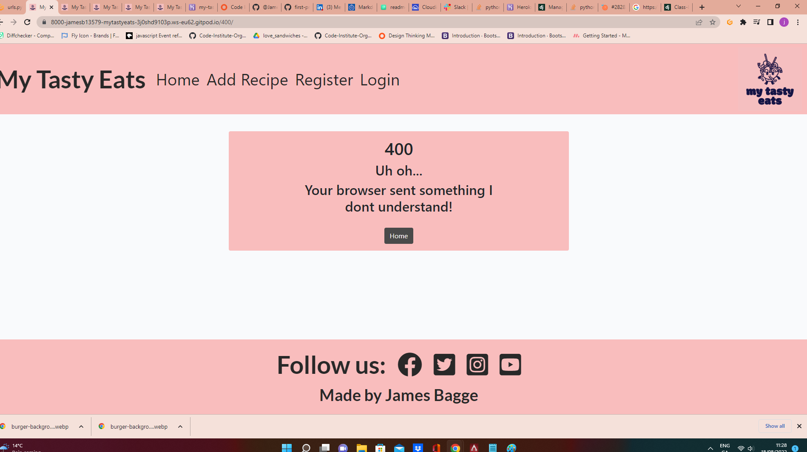
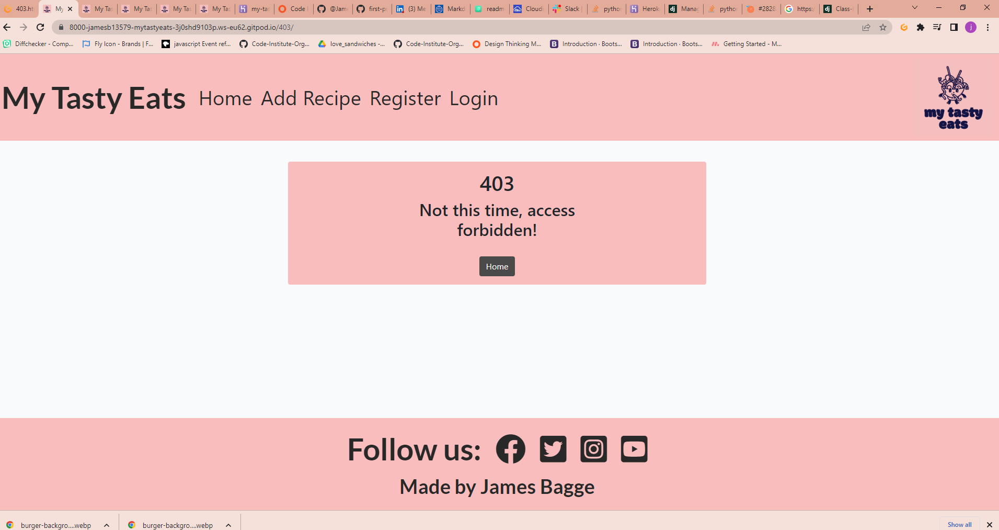
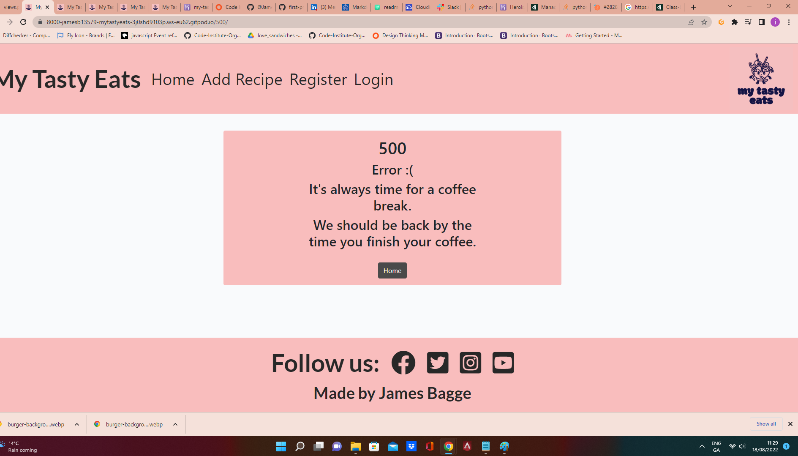

# **My Tasty Eats**

## Overview

My Tasty Eats is a website that allows members to easily share recipes. The users can create and log in to an account. Fill out a recipe form and upload their recipe to the site. They also have the ability to delete or edit recipes and like and comment on other people's recipes.

View the live project [Here]( https://my-tasty-eats.herokuapp.com/)

## User Experience (UX)

### User Stories

As a user I want to:
*   Register my account easily and efficiently, so that I can post my recipes whilst also having the ability to update and delete them if I wish.
*   Register my account, so that I can interact with other users through the comment section on the site.
*   Easily log in and log out of my account so that I can access my personal information.
*   Find social media links easily so that I can contact the site owner if needed.
*   Easily and comprehensively understand the main purposes and content of the site, so that I can then in turn gain more knowledge and understanding of how to efficiently use the site.
*   Navigate and explore different areas of the site in order to find content and be aware of the content contained within where I am on the site.
*   Be provided with a summary of all posts organised by the most recent which would appear first so that I can easily navigate through the information contained within, and then quickly decide which posts are relevant to my needs.
*   Read other users’ posts in full detail and also any comments which are related to those posts so that I can then make an informed decision on whether to review and offer feedback to that user and not repeat other suggestions from previous comments.
*   Clearly see what other recipes users have posted and also have the ability to interact and open a line of communication with other users.
*   See clearly what date a post or comment was created so that I can clearly see how relevant and up-to-date the information is.
*   Clearly see how many comments are attached to a post before clicking on the recipe in order to gain an insight into the views and opinions of others concerning particular recipes.
*   Post my recipes to the site so that I can connect with others and receive feedback on my work.
*   Update and delete my recipe posts so that I can keep the information up to date or fix any mistakes I may notice.
*   Comment on my recipe posts so that I can respond and interact with other users’ comments.
*   Access the site on various devices such as desktops, tablets, or mobile so that the site is universally accessible to the majority of users and has the ability to be accessed remotely.
*   Understand when an error occurs so that I am given clear feedback on what I should do.
*   As a site admin user, I can log in so that I can manage a supportive online peer code review community by viewing users, profiles, posts, and comments, and updating and deleting accordingly.

### Agile Approach in this Project

This website was developed using an agile method. That is, each activity is broken down into bite-sized pieces and performed iteratively so that each cycle adjusts and improves upon it as work is completed.  According to a report from the [Standish Group (2018)](https://standishgroup.myshopify.com/), Agile projects are statistically twice more likely to succeed, and a third less likely to fail than waterfall projects.

This project used a Kaban board, which was set up in GitHub Projects ([here](https://github.com/users/Jamesb13579/projects/1/views/1)) to help keep track of work to do, in progress, and completed.

## Features

1. **Favicon and logo**

A customised favicon and logo image was created using a free service from [Free Logo Design](https://www.freelogodesign.org/manager/showcase/c3daf13184dd4a90bcb4d07fef3f31d5?product=free).

2. **Header**

On purpose, the Header is fixed at the top of the screen. Light pink was picked for the background and black for the typeface in order to contrast each other and make the text easier to read.

*   Logo

    * The Logo I created for the project is the same as that which I used for the favicon. 
    
    * This logo is positioned in the top right of the navigation bar.
    
    * The logo is designed to have the same pink background colour as the rest of the header and opposite the logo to the left is the website's name.

*   Navigation Bar
    * The navigation bar is likewise located in the header. For larger screens, this is found in the top left corner. The bar contains links to different parts of the website.

    * When screen size drops below the set amount the navigation bar changes to a toggle menu.

    * Depending on whether you are logged in or not change what you can see or do with the links in the header.

        

        

3. **Landing Page**

    * The landing page brings the user straight to the six most recently uploaded recipes.

    * The background of the site is set to white to allow the Images to appear more pleasing to the eye of the user.

    * The posts are paginated every six posts and are listed with the most recent ones at the top. To make it simple for the user to navigate, the pagination is made to display not only the page numbers but also the first, previous, next, and last page.
 
        

4. **Post Detail Page**

Here the User can view the full recipe post, and delete or edit the post if they are the post creator. the user can also add a comment to the post and like it either.

5. **Register, Sign In & Log Out**

Currently, users can register for the site and log in without an email address or verification. I would hope in future versions of this site these would be included allowing users to use two-factor login and be able to receive an email verification. Currently, there is also not a built-in method to recover passwords this is also something that in the future I would like to correct. The login, Signup, and Register templates are basic Allauth templates with some small changes to suit my website better.

As previously described, once a user is logged in the navigation bar will change to display the different features the user has access to.

6. **Admin User**

A superuser was created for this project to manage the admin area. Admin users have more features than regular users, allowing them full CRUD functionality involving information such as users, profiles, posts, and comments.

Only approved admin users can access this area of ​​the site by adding /admin to the URL home page and logging in. At this time it was decided not to provide a link to it on the site, but this may be a future feature to make navigation easier for all admin users.

7. **Footer**
    *   The Footer contains the Connect with Us section.  The background and font colours are kept consistent with the theme of the site.

    *   The Facebook, Instagram, Twitter, and Youtube icons from [Font Awesome](https://fontawesome.com/) are shown at the bottom of the footer for example purposes but not linked to the respective sites.

    *   The Footer also contains the author's name.
        
        

8. **Error Pages**

Custom Error Pages were created to allow users to be able to navigate more easily back to the home page rather than having to just use the back button. This was seen as a more professional approach and allows any users who encounter one of these pages to see a fully realised site.

* 400 Bad Request - the server cannot process the request due to something that is perceived to be a user error (it may be incorrect or corrupt).
* 403 Page Forbidden - the user does not have permission to access this resource
* 404 Page Not Found - the user requested a page that is not available
* 500 Server Error - internal server error where there is a general problem with the website's server and not the fault of the user

    

    
    
    
    
    

### Features Left to Implement

The size of this project within the length of time assigned to complete it meant that certain features that would have liked to have been included have been left for later versions of the site:

*   As previously mentioned, utilising the already installed and configured allauth, support for third-party (social) authentication using services like Facebook, Twitter, or other Social Media so that users may log in to this site using their existing passwords and accounts rather than having to create new ones. Implementing email notifications and the ability to reset passwords would be simple and quick.

* Having the ability to connect your account to Social media would also allow the users to more easily share recipes with their friends and followers

*   Navigation links change colour when you hover over them, but they do not show which is the active link as certain views didn't have a URL name to style. This would have meant there would need to be a custom javascript solution with event listeners which unfortunately there wasn't time to complete.

*   A User profile page would have been good allowing users to more easily view recipes posted by that user likes, and comments and give the user a way to view their history with the site.

*   More functionality around comments would have been useful to include like the ability to link comments to more easily follow conversations between users, and also to add certain CRUD features to the user allowing them to edit old comments and delete them as well. I would also like to include the ability to report inappropriate comments for admin approval.

*   Posts are on the site currently sorted newest to oldest, I would like to give the user a way to change how posts are sorted. I would also like to give them the ability to search through old posts to find certain recipes by either name or by who the author of the recipe was.

## Design

### Data Model

I created custom data models so I would have a better view of how things would come together when the site was built. 

I chose to employ object-oriented programming for my project, and I did it by using Django's Class-Based Generic Editing Views. These sophisticated built-in views are used to implement the Create, Retrieve, Update, and Delete operations on database tables. 

### Wireframes

After designing the model, a [Balsamic Wireframes](www.balsamiq.com was created to visualize what the user would see and design a positive UX. Using a mobile-first approach, the site is designed for mobile use and then slightly redesigned for desktop viewing  [Bootstrap 5](https://getbootstrap.com/docs/5.0/getting-started/introduction/) was used with some customise CSS styling to create a personalised feel to the site.  [Font Awesome](https://fontawesome.com/) Icons were used throughout the site for social media links.

### Fonts

The fonts used were Lato, Roboto and sans-serif. Fonts were imported from [Google Fonts](https://fonts.google.com/).

### Colour Scheme

The colour scheme was chosen by using [olorate](https://colorate.azurewebsites.net/). The following palette was chosen for use on the fonts throughout the site due to high contrast for user reading accessibility:

## Testing

During development errors or warnings were fixed as they appeared such as indentation errors, lines too long, or extra space issues.  This helped keep the code clean and readable so other errors or bugs that arose were identified more easily. 

After deployment, all features were tested for responsive design on a laptop and mobile (Samsung phone and tablet). I sent the site to a couple of people who tested to see if they could find any issues and anything found was reported to me and sorted. . The website was checked on Chrome, Firefox.

Throughout the development process, page elements were inspected using Google Chrome's built-in Developer Tool, which also assisted in troubleshooting difficulties with the HTML and CSS codes.

The README.md was proofread and passed through Grammarly and all links were checked before final submission.

### Validator Testing

*   All HTML pages were run through the [W3C HTML](https://validator.w3.org/) Validator showed some errors due to Django variables and tags but all HTML passed.

*   CSS stylesheet was run through the [W3C CSS](https://jigsaw.w3.org/css-validator/) Validator and showed no errors.

*   Python files such as views.py, models.py, etc. were run through the [Pep8](http://pep8online.com/) validator, and no errors were found.

### Bugs & Issues

On one of my final look through of the project, the toggle menu wasn't showing, I had accidentally the class type styling this and hadn't realised

Another issue I found was Crispy fields not working correctly for me due to a minor spelling error.

## Security

All SECRET access keys are stored safely in the env.py file to prevent unwanted connections to the database and this was set up before the first push to Github.

Django’s setting DEBUG was set to False after development for deployment to prevent access to error screens revealing code or database entries.

Django allauth was used to set up user registration and Django’s LoginRequiredMixin and UserPassesTestMixin were used to ensure only signed-in users and authors can edit/delete their posts or comments etc.

Cross-Site Request Forgery (CSRF) tokens were used on all forms throughout this site to prevent valid requests to the backend server from being created for malicious purposes.

## Technologies Used

*   Frameworks and libraries:
    *   Django: python framework used to create all the backend logic
    *   Bootstrap5: CSS Framework for developing responsiveness and mobile-first
    *   Django-allauth: authentication library used to create the user accounts

*   Languages:
    *   Python: used to develop the server-side
    *   HTML: the markup language used to create the web pages
    *   CSS: the styling language used to add custom styling

*   Databases:
    *   SQLite: used as the database during development
    *   PostgreSQL: the database used to store all the data on deployment

*   Other tools:
    *   Github Projects: used to track the progress of the project
    *   Git: the version control system
    *   Balsamiq Wireframes: used to create the wireframes for design
    *   Chrome DevTools: used to debug the website
    *   Crispy Forms: used to manage Django Forms
    *   Cloudinary: the image hosting service used to upload images
    *   Font Awesome: used to create the icons
    *   GitHub: used to host the source code
    *   GitPod: the IDE used
    *   Heroku: the hosting service
    *   Pip3: the package manager used to install the dependencies
    *   Psycopg2: the database driver used to connect to the database
    *   Summernote: A WYSIWYG editor to allow users to edit their posts

## Deployment

The site was deployed via Heroku.
1.  Log in to Heroku or create an account if required.
2.  Then, click the button labelled New from the dashboard in the top right corner, and from the drop-down menu select Create New App.  You must enter a unique app name
3.  Next, select your region.
4.  Click on the Create App button.
5.  In your app go to the Resources tab and add a Heroku Postgres database.
6.  The next page you will see is the project’s Deploy Tab. Click on the Settings Tab and scroll down to Config Vars and enter:
    *   CLOUDINARY_URL = your cloudinary key 
    *   DATABASE_URL = the URL of your Heroku Postgres database
    *   SECRET_KEY = a secret key for your app.
    *   PORT = 8000
    *   DISABLE_COLLECTSTATIC = 1 during development and remove when deploying to production

7.  Scroll to the top of the page and now choose the Deploy tab.
8.  Select Github as the deployment method.
9.  Confirm you want to connect to GitHub.
10. Search for the repository name and click the connect button.
11. Scroll to the bottom of the deploy page and select the preferred deployment type:
12. Click either Enable Automatic Deploys for automatic deployment when you push updates to Github.
13. Select the correct branch for deployment from the drop-down menu and click Deploy Branch for manual deployment.

NB: Ensure in Django settings, that DEBUG is False, create a Procfile and save the database and cloudinary URLs and secret key to env.py.

### Version Control

The version control system in use was Git. The source code was added, saved, staged, and pushed to the GitHub repository using the commands git add, git status, git commit, and git push.

### Cloning

To clone this repository from GitHub to a local computer use the following steps:

1.  On GitHub, navigate to the main page of the repository.

2.  Above the list of files, click Code.

3.  Click Use GitHub CLI, then the copy icon.

4.  Open Git Bash and change the current working directory to the location where you want the cloned directory.

5.  Type git clone, and then paste the URL that was copied from step 3 above.

6. Press Enter to create the local clone.

### Forking
A fork is a copy of a repository. Forking a repository allows you to freely experiment with changes without affecting the original project.

To fork, this project goes to the top left of the repository, where you see the Fork Icon, and click Fork.  This will create a copy of the repository for you.

## Credits
### Content

*   [Bootstrap 5 Classes Cheatsheet](https://www.studytonight.com/bootstrap/how-to-align-bootstrap-5-navbar-items-to-the-right)

*   [Bootstrap 5 Move Nav Links Right](https://www.studytonight.com/bootstrap/how-to-align-bootstrap-5-navbar-items-to-the-right)

*   [Django Docs](https://docs.djangoproject.com/en/4.0/)

*   [Django Allauth](https://django-allauth.readthedocs.io/en/latest/)

*   [GeeksforGeeks](https://www.geeksforgeeks.org/createview-class-based-views-django/) class based views

*   [Django Slug Tutorial](https://learndjango.com/tutorials/django-slug-tutorial)

*   [Cloudinary Field in Django](https://www.section.io/engineering-education/uploading-images-to-cloudinary-from-django-application/)

*   [Summernote in Django](https://djangocentral.com/integrating-summernote-in-django/)

### Media

*   [Freelogodesign](https://www.freelogodesign.org/) used this to create a custom logo

### Thanks

I would like to thank the Code Institute program as it gave me the basis to be able to build this:

* I used the I Think Therefore I Blog, as a basic model for my app then built from there

* I learnt to build my custom error pages from a youtube video by Cryce Truly.